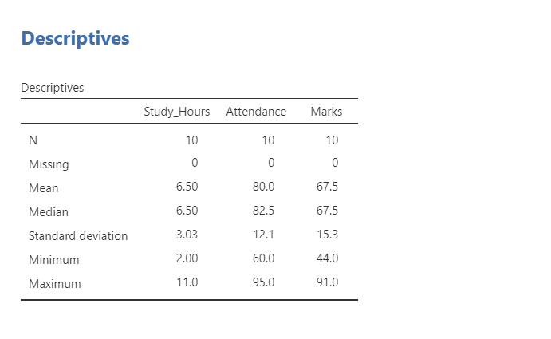
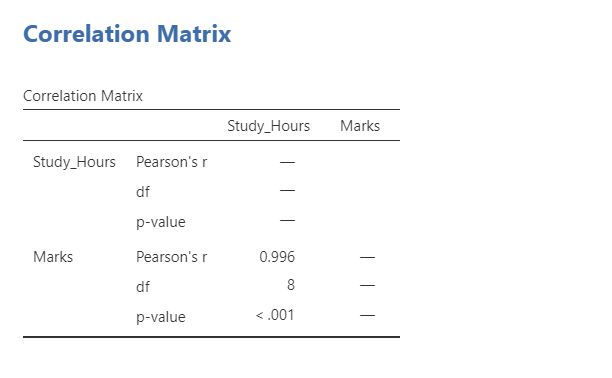
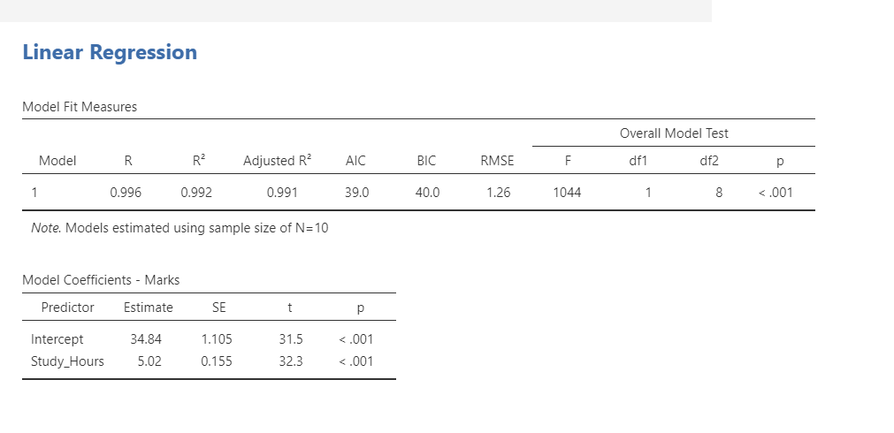
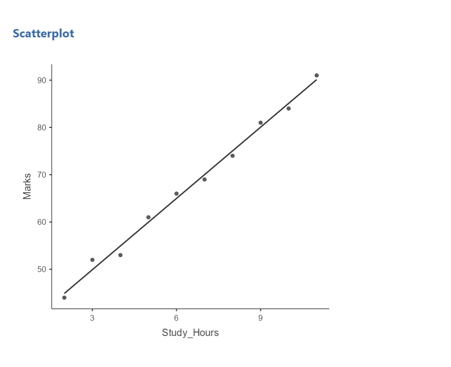

# jamovi-student-performance-analysis
Student performance analysis using Jamovi (Descriptive, Correlation, Regression)
# 📊 Student Performance Analysis using Jamovi

## 📌 Overview
This project analyzes student performance using statistical techniques in Jamovi.

## 🎯 Objectives
- Understand relationship between study hours and marks
- Perform statistical analysis

## 🛠 Tools Used
- Jamovi
- CSV Dataset

## 📊 Analysis Performed
- Descriptive Statistics
- Correlation Analysis
- Linear Regression
- Scatter Plot Visualization

## 📷 Output

### 📊 Descriptive Statistics

This output shows summary statistics such as mean, median, and standard deviation, providing an overview of the dataset.

### 🔗 Correlation

This output shows a strong positive correlation (r = 0.97) between study hours and marks.

### 📈 Regression

This regression model predicts marks based on study hours. The results indicate a significant positive relationship between the variables.

### 📉 Scatter Plot

This scatter plot with regression line shows a clear positive relationship between study hours and marks.

## 📈 Key Insights
- Strong positive correlation between study hours and marks
- Students who study more tend to score higher
- Regression model helps predict marks

## 🚀 Conclusion
This project demonstrates practical application of statistical analysis using Jamovi.
